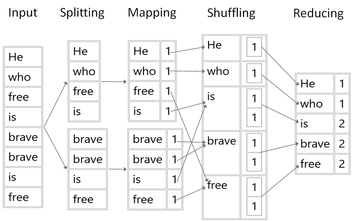

# Words Frequency. MapReduce Approch

Intermediate level task for practicing collection classes.

Estimated time to complete the task - 2h.

The task requires .NET 6 SDK installed.

## Task Details

Using MapReduce calculate the frequency of each word in an input text. MapReduce is a programming model used for efficient processing in parallel over large data-sets in a distributed manner. The data is first split and then combined to produce the final result. To solve this problem, the following steps need to be taken: 
- input (input text can be read from a set of text large files - is not considered for this task)
- splitting
- mapping
- shuffling
- reducing
- output (all the output tuples then may be collected and written for example in the output file - is not considered for this task)

- First the input data are split to distribute the work among all the map nodes (two nodes in the figure abowe). 
- Then each word is identified and mapped to the number one. Thus the pairs also called as tuples are created. In the first mapper node on the picture four words 'He', 'who', 'free' and 'is' are passed. Thus the output of the node will be four key/value pairs with four distinct keys and value set to one. The mapping process remains the same in all the nodes. 
- A partitioner comes into action which carries out shuffling so that all the tuples with same key are sent to same node.
- These tuples are then passed to the reduc node. The reducer node processes all the tuples such that all the pairs with same key are counted and the count is updated as the value of that specific key. In the example there are two pairs with the key 'brave' which are then reduced to single tuple with the value equal to the count.

